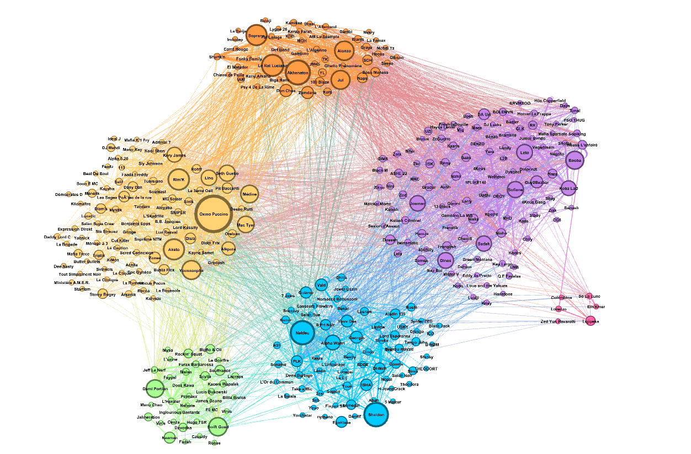
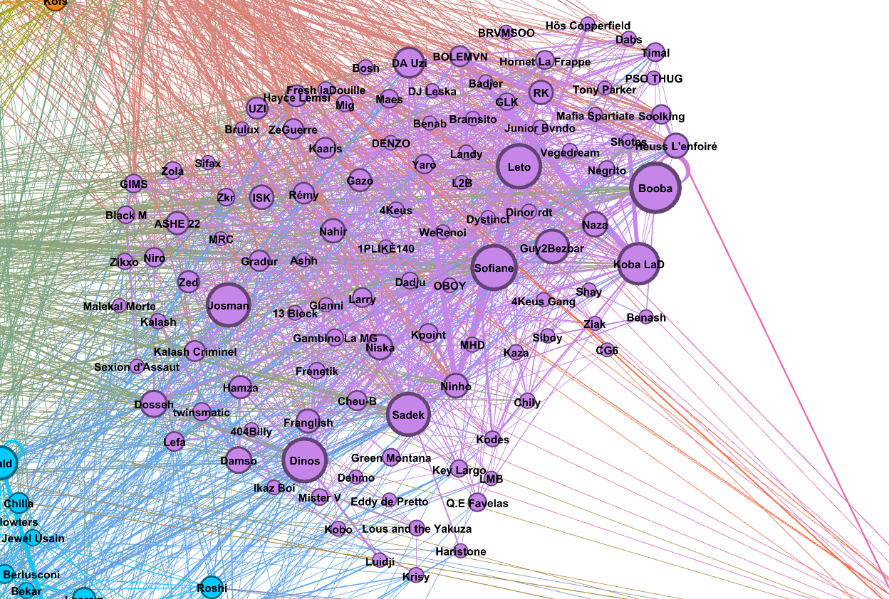
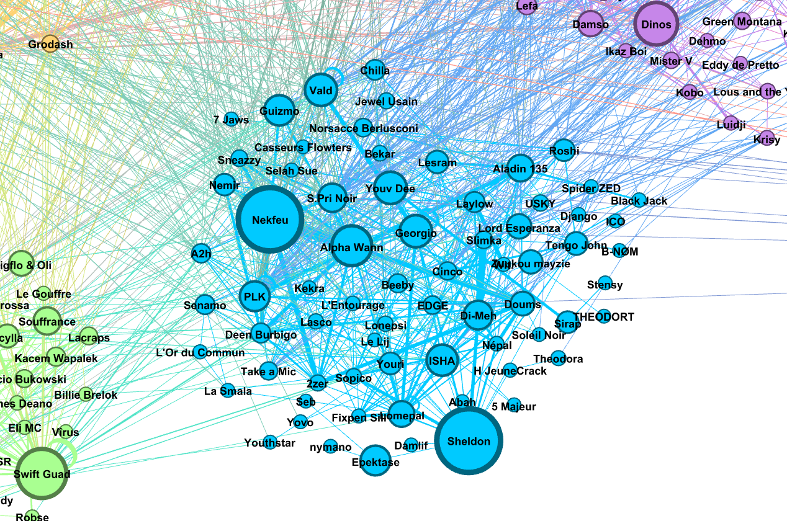

# French Rap Collaboration Graphs

School project for the **CSC_43M02_EP Modal - Exploration and Learning on Web Graphs** course at École polytechnique, by Arthur Fournier and Arthur Buis.

<p align="center">
  
  <br>
  <em>Collaboration graph of French rap artists, visualised in Gephi. Colours are the detected communities.</em>
</p>

<table>
  <tr>
    <td width="50%"></td>
    <td width="50"></td>
  </tr>
  <tr>
    <td align="center"><em>Zoom on a community</em></td>
    <td align="center"><em>Zoom on another community</em></td>
  </tr>
</table>

We build and analyse three graphs of French rap artists with data collected from Spotify, Genius, MusicBrainz and Last.fm:

| Graph | Nodes | Edges |
|---|---|---|
| **Collaborations** (Main graph) | Artists | Songs made together (featurings), weighted by the number of songs |
| **Lyrics embeddings** | Artists | Cosine similarity ≥ 0.98 between the mean [Word2Bezbar](https://huggingface.co/rapminerz/Word2Bezbar-large) vectors of their lyrics |
| **Last.fm similarity** | Artists | Artists listed as similar by Last.fm, weighted by the match score |

The graphs are stored in MongoDB, analysed with NetworkX (statistics, centralities, community detection) and visualised with [Gephi](https://gephi.org/).

**Report** (available in French): [`report/modal_report_fr.pdf`](report/modal_report_fr.pdf). [Online report](https://plmlatex.math.cnrs.fr/read/hvtgtnmvykbn).

## Repository structure

```
src/rap_graph/
├── cli.py              # `rap-graph` command line entry point
├── config.py           # Settings read from environment variables / .env
├── db.py               # MongoDB pipeline: artists, Genius ids, embeddings, featurings
├── embeddings.py       # Lyrics fetching, cleaning and Word2Bezbar artist vectors
├── sources/            # API clients: spotify, genius, musicbrainz, lastfm
└── graphs/
    ├── common.py       # Clustering, statistics, cleaning and GEXF export
    ├── collab.py       # Collaboration graph
    ├── embedding.py    # Lyrics similarity graph
    └── lastfm.py       # Last.fm similarity graph
data/                   # Databases we built (artists, featurings, embeddings)
graphs/                 # Exported graphs (.gexf) and Gephi projects (.gephi)
report/                 # Project report (French)
```

### Data

- `data/artists.csv` - the 477 artists kept (Spotify id, popularity, followers, Genius id and url, MusicBrainz id).
- `data/featurings.csv` - the ~8,900 songs involving at least two of these artists.
- `data/artists_embeddings.json` - the same artists with their lyrics embeddings (MongoDB export).

### Graphs

- `collaborationgraph/` - collaboration graph clustered with Louvain and clique percolation (`.gexf`), and Gephi projects with node size by betweenness, degree and popularity/followers (`.gephi`).
- `embeddinggraph/` - lyrics similarity graph clustered with Louvain, and a Gephi project combining the embedding and Last.fm graphs.
- `lastfmgraph/` - Last.fm similarity graph clustered with Louvain.

## Setup

Requirements: [uv](https://docs.astral.sh/uv/) and [Docker](https://docs.docker.com/get-docker/) (to run MongoDB).

```bash
docker run -d --name rap-mongo -p 27017:27017 -v rap-mongo-data:/data/db mongo:7
uv sync                    # creates .venv with Python 3.12 and all dependencies
cp .env.example .env       # then fill in your API keys
```

API keys are only needed for the commands that call the corresponding service:

| Variable | Used by |
|---|---|
| `SPOTIFY_CLIENT_ID`, `SPOTIFY_CLIENT_SECRET` | `fetch-artists --search-new` |
| `GENIUS_ACCESS_TOKEN` | `fetch-artists --genius/--embeddings`, `retry-failed`, `fetch-featurings` |
| `LASTFM_API_KEY` | `build-graph lastfm` |
| `MONGO_URI`, `MONGO_DB` | everything (defaults: `mongodb://localhost:27017/`, `rap_graph`) |

The Word2Bezbar model is downloaded automatically from Hugging Face the first time embeddings are computed.

## Usage

Every command accepts `--db <name>` to choose the MongoDB database. Run `uv run rap-graph <command> --help` for all the options.

**1. Build the artists database**

```bash
# Search artists on Spotify and MusicBrainz, then find their Genius / MusicBrainz ids and embeddings
uv run rap-graph fetch-artists --search-new --genius --musicbrainz --embeddings

# Interactively find the artists that could not be matched on Genius
uv run rap-graph retry-failed
```

Or start from our cleaned artists list (this **replaces** the `artists` collection):

```bash
uv run rap-graph import-artists-csv
```

To build the embedding graph without recomputing the embeddings, import the artists with their embeddings instead:

```bash
docker exec -i rap-mongo mongoimport --db rap_graph --collection artists --jsonArray --drop < data/artists_embeddings.json
```

**2. Fetch the featurings**

```bash
uv run rap-graph fetch-featurings
```

Or start from our cleaned featurings list (this **replaces** the `featurings` collection):

```bash
uv run rap-graph import-featurings-csv
```

**3. Build, cluster and export a graph**

```bash
uv run rap-graph build-graph collab     # -> graphs/collab_louvain_new.gexf
uv run rap-graph build-graph embedding --no-plot
uv run rap-graph build-graph lastfm --method greedy_modularity
```

Small connected components are removed (fewer than 10 nodes for `collab`, 5 otherwise, see `--min-component`), graph statistics are printed, then communities are detected with `--method` (`louvain`, `k_clique`, `label_propagation`, `girvan_newman`, `greedy_modularity`). The result is saved to `graphs/<type>_<method>_new.gexf` (or `--output`), so the graphs committed in `graphs/` are never overwritten.

**4. Explore in Gephi**

Open the `.gexf` file (or one of our `.gephi` projects) from `graphs/` in Gephi. The `cluster` node attribute holds the detected community.
